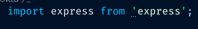
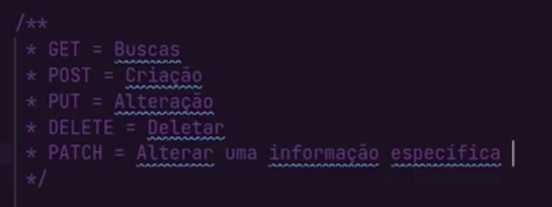
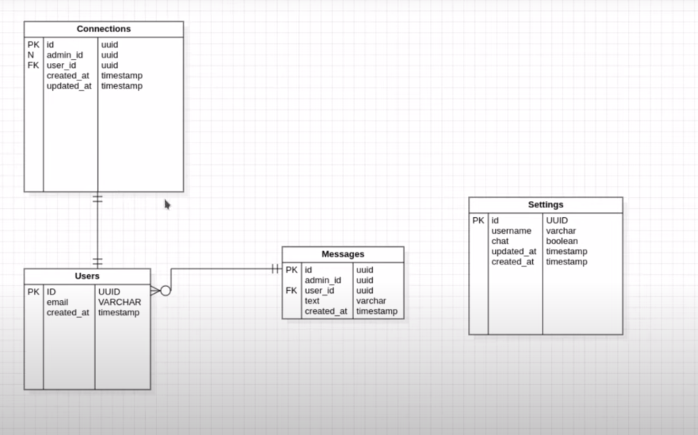
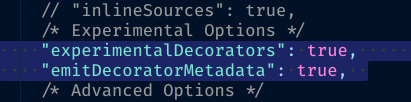
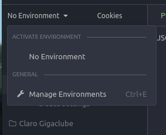
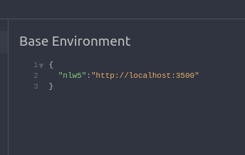
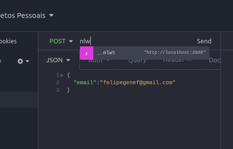
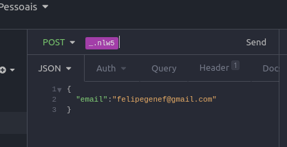
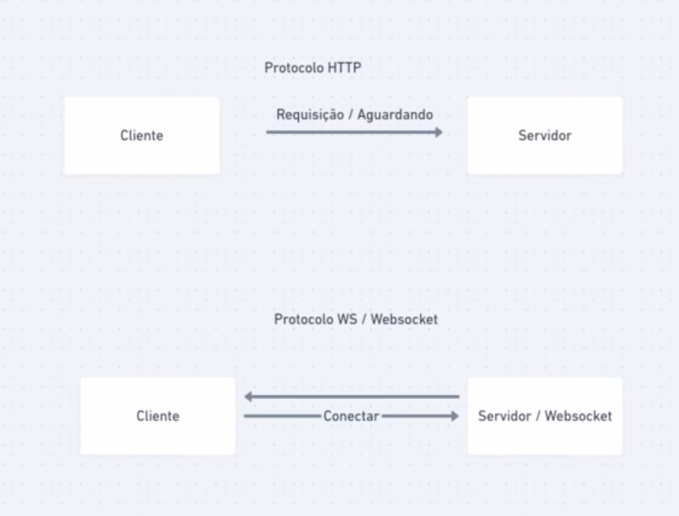

</head><body><article id="1c91580d-5919-4dcb-af91-ae42ae756ea8" class="page serif"><header>

<h1 class="page-title">NLW 5 NodeJs</h1><table class="properties"><tbody><tr class="property-row property-row-created_time"><th><svg viewBox="0 0 14 14" style="width:14px;height:14px;display:block;fill:rgba(55, 53, 47, 0.4);flex-shrink:0;-webkit-backface-visibility:hidden" class="typesCreatedAt"><path d="M6.98643729,14.0000972 C5.19579566,14.0000972 3.40419152,13.3106896 2.04245843,11.9323606 C-0.681017475,9.21200555 -0.680780251,4.76029539 2.04293482,2.04012507 C4.76664406,-0.68004331 9.22427509,-0.68004331 11.9480135,2.04013479 C13.272481,3.36277455 14,5.1330091 14,6.99552762 C14,8.87640182 13.2721894,10.6285043 11.9480135,11.9509302 C10.5679344,13.3105924 8.77756503,14.0000972 6.98643729,14.0000972 Z M10.2705296,7.00913883 L10.2705296,8.46099754 L10.2705296,8.65543362 L10.076181,8.65543362 L8.6543739,8.65543362 L5.72059514,8.65543362 L5.52619796,8.65543362 L5.52619796,8.46099754 L5.52619796,5.52541044 L5.52619796,3.37946773 L5.52619796,3.18502193 L5.72059514,3.18502193 L7.17253164,3.18502193 L7.36692883,3.18502193 L7.36692883,3.37946773 L7.36692883,6.81467358 L10.076181,6.81467358 L10.2705296,6.81467358 L10.2705296,7.00913883 Z M12.1601539,6.99552762 C12.1601539,5.61697497 11.6190112,4.32597154 10.6393933,3.34769528 C8.63253764,1.34336744 5.35197452,1.34061603 3.34153136,3.33944106 C3.33868273,3.34219247 3.33607716,3.34494388 3.33322852,3.34769528 C1.32397148,5.35459953 1.32372842,8.63641682 3.33322852,10.6433794 C5.34295224,12.6504489 8.62968901,12.6504489 10.6393933,10.6433794 C11.6190112,9.66506426 12.1601539,8.37408027 12.1601539,6.99552762 Z"></path></svg>Created</th><td><time>@Apr 19, 2021 9:25 AM</time></td></tr><tr class="property-row property-row-multi_select"><th><svg viewBox="0 0 14 14" style="width:14px;height:14px;display:block;fill:rgba(55, 53, 47, 0.4);flex-shrink:0;-webkit-backface-visibility:hidden" class="typesMultipleSelect"><path d="M4,3 C4,2.447715 4.447715,2 5,2 L12,2 C12.5523,2 13,2.447716 13,3 C13,3.55228 12.5523,4 12,4 L5,4 C4.447715,4 4,3.55228 4,3 Z M4,7 C4,6.447715 4.447715,6 5,6 L12,6 C12.5523,6 13,6.447716 13,7 C13,7.55228 12.5523,8 12,8 L5,8 C4.447715,8 4,7.55228 4,7 Z M4,11 C4,10.447715 4.447715,10 5,10 L12,10 C12.5523,10 13,10.447716 13,11 C13,11.55228 12.5523,12 12,12 L5,12 C4.447715,12 4,11.55228 4,11 Z M2,4 C1.44771525,4 1,3.55228475 1,3 C1,2.44771525 1.44771525,2 2,2 C2.55228475,2 3,2.44771525 3,3 C3,3.55228475 2.55228475,4 2,4 Z M2,8 C1.44771525,8 1,7.55228475 1,7 C1,6.44771525 1.44771525,6 2,6 C2.55228475,6 3,6.44771525 3,7 C3,7.55228475 2.55228475,8 2,8 Z M2,12 C1.44771525,12 1,11.5522847 1,11 C1,10.4477153 1.44771525,10 2,10 C2.55228475,10 3,10.4477153 3,11 C3,11.5522847 2.55228475,12 2,12 Z"></path></svg>Tags</th><td></td></tr></tbody></table></header>

 
<h1 id="3dcaed09-2587-49ff-ad44-867528875df9" class="">Aula 1</h1><h2 id="9bc18dd6-26c1-49f6-9ec1-058746707799" class="">Setup de ambiente e conhecendo o NodeJs</h2>
Nesta primeira aula , falamos um pouco sobre a estrutura do node e das dores que ele soluciona. Dentre elas a necessidade de um sistema de entradas e saidas <strong>não boqueante</strong>, assim como a facilidade para <strong>trabalhar com arquivos</strong> e a leveza. Falamos também sobre o <strong>Typescript </strong>e o porquê de utiliza-lo. 

Por fim , criamos os primeiros metodos de http para a nossa API.
<h3 id="c82abdb8-1b30-46a2-a829-53237d204998" class="">Código para iniciar um projeto com yarn</h3><pre id="8ff40b0c-1ab8-4cf0-951b-600c9761a158" class="code"><code>yarn init -y</code></pre><h3 id="244e115f-4a4b-4322-a269-fd0299a97ddb" class="">Código para adicionar um pacote pelo yarn</h3><pre id="21e78feb-4b63-4b42-8390-0ebc1341f970" class="code"><code>yarn add nomeDoPacote</code></pre><h3 id="d21a39e7-fab6-41e0-b43c-d7dc4b019f4a" class="">Código para instalar o typescript</h3><pre id="86949e56-9f60-42c4-b3a0-4496a4e6b037" class="code"><code>yarn add typescript -D</code></pre><h3 id="4ad81885-0244-44a1-81a9-7fa82f373281" class="">Código para criar um arquivo de configurações typescrit</h3>
 
<pre id="1aadf335-3570-46ca-b34f-3ef0463d0657" class="code"><code>yarn tsc --init</code></pre>
Após criar esse arquivo, modificamos as variaveis <strong>strict para false</strong> dentro dele.
<h2 id="67c38426-3e5a-4906-beee-ed8a87268446" class="">Instalar as tipagens de um pacote</h2>
Quando utilizamos typescript, obtemos algumas vantagens em relação ao javascript. Dentre elas, poder <strong>ver todos os métodos encontrados</strong> dentro de nossos imports e objetos. Quando houver essa tipagem para ser importada , irão aparecer <strong>tres pontinhos</strong> na frente de seu import como mostra a imagem abaixo.
<figure id="e323c5c4-2da6-4fca-a889-2bd5ae8620e1" class="image"></figure>
Uma vez que isso occorra , podemos importar as tipagens utilizando o comando:
<h3 id="d98866cc-639d-462f-9d46-c6bc51b19461" class="">Código para instalar as tipagens de um pacote</h3><pre id="2dc7108b-b724-422b-90dd-2c3d735dc359" class="code"><code>yarn add @types/nomeDoPacote -D</code></pre><h2 id="c919a47b-01d9-456c-85c1-7818625135b6" class="">Formatar o node para utilizar import no lugar de require</h2>
Para isso , precisamos fazer um import que faça a tradução de um para outro.Nota-se <strong>também que o ts-node substitui o nodemon </strong>, uma vez que ele também mantém a aplicação rodando após uma atulaização no codigo.
<pre id="ce32d78d-c224-42cb-bc28-903a3ca7317f" class="code"><code>yarn add ts-node-dev -D</code></pre>
Agora é so adicionar um script para que ele rode no lugar do nosso node fazendo a tradução. Para isso, adicionamos um script no nosso <strong>package.json</strong>
<pre id="2edda6b6-fc01-418d-823b-48169c9c92bf" class="code"><code>&quot;scripts&quot;: {
    &quot;dev&quot;: &quot;ts-node-dev src/server.ts&quot;
  },</code></pre><h2 id="297b14ad-77b3-4878-9fe7-9ca0f91b2bd1" class="">Tipos de Rotas</h2><figure id="fceba57c-1eb1-408d-82f4-d57d8e1432ba" class="image"></figure><h1 id="1110ccb7-11d9-48c4-b817-90514ca84df2" class="">Aula 2</h1>
Para essa aplicação vamos utilizar um banco de dados <strong>relacional</strong> chamado <strong>SQLite  ( que é um banco de dados em memória )</strong> e um <strong>ORM(object relational mapper)  </strong>chamado <strong>TypeORM.</strong>
<h2 id="0408a70e-8d2c-41f6-aab8-54daa0965a60" class="">Configuraçoes do banco</h2>
Para utilizar o SQLite , criamos um arquivo <strong>ormconfi.json </strong>na raz de nosso projeto e inserimos o seguinte código.
<pre id="2755bbdf-c8f2-4e70-ac11-22e701c10b9e" class="code"><code>{
    &quot;type&quot;: &quot;sqlite&quot;,
    &quot;database&quot;: &quot;./src/database/database.sqlite&quot;,
    &quot;migrations&quot;: [
        &quot;./src/database/migrations/**.ts&quot;
    ],
    &quot;entities&quot;: [
        &quot;./src/entities/**.ts&quot;
    ],
    &quot;cli&quot;: {
        &quot;migrationsDir&quot;: &quot;./src/database/migrations&quot;
    }
}</code></pre>
depois criamos uma pasta chamada database e colocamos um arquivo chamado index com o seguinte código
<pre id="5f08cbc2-87fe-4191-b62d-b035e8ea67e3" class="code"><code>import { createConnection } from &#x27;typeorm&#x27;

createConnection();</code></pre>
Por fim , <strong>importamos </strong>esse arquivo em nosso server.ts
<h3 id="226379b7-e5b8-46ab-97dd-e5bda4914d90" class="">Criando migrations</h3>
Primeiro criamos uma pasta chamada migrations em nossa pasta database. Depois colocamos mais um script em nosso package.json 
<pre id="bac88005-454d-4bfb-8b40-203d96f51c32" class="code"><code>&quot;scripts&quot;: {
&quot;dev&quot;: &quot;ts-node-dev src/server.ts&quot;,
&quot;typeorm&quot;: &quot;ts-node-dev node_modules/typeorm/cli.js&quot;
},</code></pre><h2 id="6b3496ee-903b-4efd-bff4-4d37f9771fba" class="">Gerando a migration</h2>
Por fim , o comando para criarmos nossas migrations é:
<pre id="43c8888c-2153-4b32-8782-88ef7c981290" class="code"><code>yarn typeorm migration:create -n nomeDaMigration</code></pre><h2 id="a5a436a2-e80a-4dc7-9794-7c570abbaca1" class="">Executando os comandos das migrations</h2><pre id="775e317e-1c74-4915-bdc7-79c112cd227e" class="code"><code>yarn typeorm migration:run</code></pre><h2 id="0569e86e-8599-4c33-8f83-338482fc00a7" class="">Apagando migrations</h2><pre id="4947ba34-89c8-4331-aa05-f216f4dd29a0" class="code"><code>yarn typeorm migration:reverse</code></pre><h2 id="f44f5ab2-c916-4257-bb05-742a1dd647dd" class="">Tabelas</h2><figure id="8f6d4f4f-056d-4a20-af44-58fe0d11d3cf" class="image"></figure><h2 id="12984547-9815-4b27-96fc-5406ba62f670" class="">Exemplo de migration</h2><pre id="00d48ecd-992a-4026-ace8-87908b2ffdd8" class="code"><code>import { MigrationInterface, QueryRunner, Table } from &quot;typeorm&quot;;

export class createSettings1619020598404 implements MigrationInterface {

    public async up(queryRunner: QueryRunner): Promise&lt;void&gt; {
        await queryRunner.createTable(
            new Table(
                {
                    name: &quot;settings&quot;,
                    columns: [
                        {
                            name: &quot;id&quot;,
                            type: &quot;uuid&quot;,
                            isPrimary: true
                        },
                        {
                            name: &quot;username&quot;,
                            type: &quot;varchar&quot;,
                        },
                        {
                            name: &quot;chat&quot;,
                            type: &quot;boolean&quot;,
                            default: true
                        },
                        {
                            name: &quot;updated_at&quot;,
                            type: &quot;timestamp&quot;,
                            default: &quot;now()&quot;
                        },
                        {
                            name: &quot;created_at&quot;,
                            type: &quot;timestamp&quot;,
                            default: &quot;now()&quot;
                        }
                    ]
                }
            )
        );
    }

    public async down(queryRunner: QueryRunner): Promise&lt;void&gt; {
        await queryRunner.dropTable(&#x27;settings&#x27;);
    }

}</code></pre><h2 id="f63127b9-be58-4683-9181-b20f56476b91" class="">Models</h2>
Primeiro criamos mais uma pasta destro de src chamada entities(ou models) e criamos nossos modelos.
<h2 id="9d3c6f04-cd8d-4d04-ac63-c02c7c090535" class="">Exemplo de Model</h2><pre id="0572ed44-5bdb-4d83-a4a2-e9009604c4dd" class="code"><code>import { Entity, Column, CreateDateColumn, UpdateDateColumn, PrimaryColumn } from &#x27;typeorm&#x27;

@Entity(&quot;settings&quot;)
class Settings {

    @PrimaryColumn()
    id: string;

    @Column()
    userName: string;

    @Column()
    chat: boolean;

    @UpdateDateColumn()
    updated_at: Date;

    @CreateDateColumn()
    created_at: Date;

}
export { Settings };</code></pre><h2 id="d45c16a9-e78e-41e5-93e3-374ef0e1d402" class="">Habilitar variaveis sem passar nome</h2>
Quando criamos o modelo acima , precisamos passar alguns parametros para a configuração para que o nome da variavel seja considerado como o mesmo do nome do modelo sem passar o parametro name dentro dos parenteses das notations.

Dentro do nosso <strong>tsconfig.json</strong> precisamos <strong>descomentar as seguintes linhas</strong>
<figure id="9ecedbdb-12dd-444f-843f-5de2b280ebe2" class="image"></figure><h2 id="645306f3-c308-4d0d-82b7-89515ae7bb46" class="">Geração de UUID</h2>
Para geração dos ids de nossa tabela, que definimos como UUIDS, vamos utilizar a propria biblioteca de UUID
<pre id="d9763e58-0b96-48ad-b717-2bf386d35be5" class="code"><code>yarn add uuid</code></pre><pre id="89ad5445-a1a4-4023-9661-0e9ea9a693d2" class="code"><code>yarn add @types/uuid -D</code></pre>
Agora para fazer com que nossa aplicação gere os uuids com a biblioteca , inserimos o seguinte codigo no modelo
<pre id="fa498baf-a7b0-4bc6-a16c-e2e6c9e6ae2c" class="code"><code>import { Entity, Column, CreateDateColumn, UpdateDateColumn, PrimaryColumn } from &#x27;typeorm&#x27;
import { v4 as uuid } from &#x27;uuid&#x27;

@Entity(&quot;settings&quot;)
class Settings {

    @PrimaryColumn()
    id: string;

    @Column()
    userName: string;

    @Column()
    chat: boolean;

    @UpdateDateColumn()
    updated_at: Date;

    @CreateDateColumn()
    created_at: Date;

    constructor() {
        if (!this.id) {
            this.id = uuid();
        }
    }

}
export { Settings };</code></pre><h2 id="4ace3623-8658-4aac-b1e8-69ad67deef8e" class="">Criar repositorios</h2><pre id="63fba386-fb05-45d9-924f-c5f12364031e" class="code"><code>import { EntityRepository, Repository } from &quot;typeorm&quot;;
import { Settings } from &quot;../database/models/settings&quot;;

@EntityRepository(Settings)
class SettingsRepository extends Repository&lt;Settings&gt;{

}
export { SettingsRepository }</code></pre><h2 id="40bd0632-4d52-46e2-aa50-7c8ae32e372f" class="">Endpoint para criar usando model</h2><pre id="be154062-9cca-46d8-b187-c7b52c205cfc" class="code"><code>routes.post(&#x27;/settings&#x27;, async (request, response) =&gt; {
const { userName, chat } = request.body;

    const settingsRepository = getCustomRepository(SettingsRepository);

    const setting = settingsRepository.create({ chat, userName });

    await settingsRepository.save(setting);

    response.json(setting)

});</code></pre>
Por ultimos fizemos um <strong>controller</strong> para <strong>isolar essas funções por tema </strong>e jogamos nossa request para la.
<h1 id="1c097a04-b0c9-4027-b797-ebbed6cae3d7" class="">Aula 3</h1>
Primeiramente nessa aula criamos um <strong>service</strong> para <strong>separar as regras de negocio</strong> do escopo do <strong>controller</strong>.

Depois Fizemos um <strong>try/catch</strong> para responder com erro 400 caso o <strong>usuário ja exista</strong>.

Logo em seguida , fizemos todo o <strong>processo de migrations e entities para os usuários</strong>.
<h2 id="c461b872-6371-442d-9205-2999fed12209" class="">Criar Variáveis dentro do insomnia</h2>
Para que não precisemos <strong>modificar sempre as portas das urls</strong> uma por uma , criamos <strong>variáveis dentro do insomnia</strong>. Para isso somente precisamos clicar em environment ecolocar dentro do json apresentado, nossas variaveis.
<figure id="5a772693-ec9f-4429-be44-92c125ea18c2" class="image"></figure><figure id="12f09a23-0861-4f19-bd02-02cccfbe5d5b" class="image"></figure>
Uma vez inserido , so precisamos <strong>escrever a chave da variavel</strong> na rota e digitar <strong>ctrl espaço.</strong>
<figure id="7dedaddb-3d89-459a-aea1-8d23a5906496" class="image"></figure><figure id="c10613ad-db67-4384-9e37-7fd1f46bd77d" class="image"></figure><h2 id="8b2d4938-d27e-4d1d-a251-fd9d7f578950" class="">Definição de Foreign Key nas migrations</h2>
Para definir uma foreign key , precisamos passar como parametro <strong>na migration</strong> uma <strong>lista de foreign keys</strong> como mostram os exemplos abaixo
<pre id="fc919847-2e84-4a3d-83cf-03b5b1166741" class="code"><code>import {
MigrationInterface,
QueryRunner,
Table,
TableForeignKey,
} from &quot;typeorm&quot;;

export class CreateConnections1619294514651 implements MigrationInterface {
public async up(queryRunner: QueryRunner): Promise&lt;void&gt; {
await queryRunner.createTable(
new Table({
name: &quot;connections&quot;,
columns: [
{
name: &quot;id&quot;,
type: &quot;uuid&quot;,
isPrimary: true,
},
{
name: &quot;admin_id&quot;,
isNullable: true,
type: &quot;uuid&quot;,
},
{
name: &quot;user_id&quot;,
type: &quot;uuid&quot;,
},
{
name: &quot;socket_id&quot;,
type: &quot;varchar&quot;,
},
{
name: &quot;updated_at&quot;,
type: &quot;timestamp&quot;,
default: &quot;now()&quot;,
},
{
name: &quot;created_at&quot;,
type: &quot;timestamp&quot;,
default: &quot;now()&quot;,
},
],
})
);
await queryRunner.createForeignKey(
&quot;connections&quot;,
new TableForeignKey({
name: &quot;fk_connection&quot;,
referencedTableName: &quot;users&quot;,
referencedColumnNames: [&quot;id&quot;],
columnNames: [&quot;user_id&quot;],
onDelete: &quot;SET NULL&quot;,
onUpdate: &quot;SET NULL&quot;,
})
);
}

public async down(queryRunner: QueryRunner): Promise&lt;void&gt; {
await queryRunner.dropForeignKey(&quot;connections&quot;, &quot;fk_connection&quot;);
await queryRunner.dropTable(&quot;connections&quot;);
}
}</code></pre><pre id="6adc5cd2-fc1b-4c9d-9301-bd5c68442460" class="code"><code>import {MigrationInterface, QueryRunner, Table} from &quot;typeorm&quot;;

export class createMessages1619185505389 implements MigrationInterface {

    public async up(queryRunner: QueryRunner): Promise&lt;void&gt; {
        await queryRunner.createTable(

            new Table({
                name:&#x27;messages&#x27;,
                columns:[
                    {
                        name:&#x27;id&#x27;,
                        type:&#x27;uuid&#x27;,
                        isPrimary:true
                    },
                    {
                        name:&#x27;admin_id&#x27;,
                        type:&#x27;uuid&#x27;,
                        isNullable:true
                    },
                    {
                        name:&#x27;user_id&#x27;,
                        type:&#x27;uuid&#x27;,
                    },
                    {
                        name:&#x27;text&#x27;,
                        type:&#x27;varchar&#x27;,
                    },
                    {
                        name:&#x27;created_at&#x27;,
                        type:&#x27;timestamp&#x27;,
                        default:&#x27;now()&#x27;
                    }
                ],
                foreignKeys:[
                    {
                        name:&#x27;fk_user&#x27;,
                        referencedTableName:&#x27;users&#x27;,
                        referencedColumnNames:[&#x27;id&#x27;],
                        columnNames:[&#x27;user_id&#x27;],
                        onDelete:&#x27;SET NULL&#x27;,
                        onUpdate:&#x27;SET NULL&#x27;
                    }
                ]
            })
        )
    }

    public async down(queryRunner: QueryRunner): Promise&lt;void&gt; {
        await queryRunner.dropTable(&#x27;messages&#x27;)
    }

}</code></pre><h2 id="04c18dfb-cf0a-4950-a73f-b9c209c840cf" class="">Definição de Foreign Key nos Models</h2><pre id="b7e60511-6d1e-483a-b113-d58ec65c080f" class="code"><code>import {Entity,PrimaryColumn,CreateDateColumn,Column, ManyToOne, JoinColumn} from &#x27;typeorm&#x27;
import { v4 as uuid } from &#x27;uuid&#x27;
import { User } from &#x27;./User&#x27;;

@Entity(&#x27;messages&#x27;)
class Message {

    @PrimaryColumn()
    id:string;

    @Column()
    admin_id:string;

    @Column()
    text:string;

    @JoinColumn({name:&#x27;user_id&#x27;})
    @ManyToOne(()=&gt;User)
    user:User

    @Column()
    created_at:Date;

    @Column()
    user_id:string;

    constructor() {
        if (!this.id) {
            this.id = uuid();
        }
    }

}</code></pre><h2 id="978c922e-96ca-41b3-a959-a1b4db87f3bc" class="">Aula 4</h2><h2 id="3587fbb4-773a-40bd-a576-f8e7cd46b804" class="">Websockets</h2><h3 id="09c3ca9c-4d90-45a3-9110-e6419b44dd25" class="">HTTP vs Websockets</h3><figure id="e002d830-558d-4eb9-9650-0d20b171afde" class="image"></figure>

<h2 id="c5d65e2c-b46f-46df-8f1e-bc37df54d1e5" class="">Criando um vervidor WS com o socketIO</h2><pre id="d831042e-6a50-4044-a11f-76a63fbc8e48" class="code"><code>import express from &#x27;express&#x27;;
import {createServer} from &#x27;http&#x27;
import {Server, Socket} from &#x27;socket.io&#x27;

import &#x27;./database&#x27;
import { routes } from &quot;./routes&quot;;

const PORT = process.env.PORT || 3500;

const app = express();

const http = createServer(app); //criando o protocolo http
const io = new Server(http); // criando o protocolo ws</code></pre>
 Fique atento que ao declarar o servidor http e o servidor websocket , devemos modificar o antigo codigo
<pre id="7d238337-5987-4b7f-bc7a-f2842a2814d2" class="code"><code>app.listen(PORT, () =&gt; console.log(`Server is running on ${PORT} `));</code></pre>
Para
<pre id="5c24740f-dbb9-4530-b6d4-9c7e5c507bb4" class="code"><code>http.listen(PORT, () =&gt; console.log(`Server is running on ${PORT} `));</code></pre><h2 id="8fdd0a9b-5901-47d3-b7f9-00666d50d427" class="">Baixar Frontend</h2>
Baixamos a pasta <strong>Public </strong>onde veio toda a parte do<strong> frontend </strong>que ja estava feita para nós.

Agora declaramos nossa pasta de aquivos publicos para que o servidor entendessa da seguinte forma.
<pre id="daa5e8f8-15b2-448c-ae9c-857040c1f1b0" class="code"><code>app.use(express.static(path.join(**dirname,&#x27;..&#x27;,&#x27;public&#x27;)))
app.set(&#x27;views&#x27;,path.join(**dirname,&#x27;..&#x27;,&#x27;public&#x27;));
app.engine(&#x27;html&#x27;,require(&quot;ejs&quot;).renderFile);
app.set(&#x27;view engine&#x27;,&#x27;html&#x27;)</code></pre>
Agora nosso front end está rodando! PAra acessarmos nossa aplicação , precisamos fazer uma rota da seguinte forma:
<pre id="23a89f42-5327-4ca0-8b3b-fbb25dc40392" class="code"><code>app.get(&#x27;/pages/client&#x27;,(request,response)=&gt;{
return response.render(&#x27;html/client.html&#x27;);
});</code></pre>
Para que possamos utilizar o <strong>socket em mais partes da aplicação </strong>isolamos todo o nosso codigo ques estava no server.ts para um arquivo chamado<strong> http.ts</strong> e importamos o http do arquivo http.ts para o <strong>server.ts</strong>. Assim ao <strong>exportarmos tanto o io, quanto o http </strong>temos acesso a eles em toda a nossa aplicação.

Agora , apos criarmos as tableas de connections e fazermos as devidas configurações das novas tabelas , criamos nosso codigo de websockets do client em que <strong>criamos o usuário se não existir</strong> e <strong>armazenamos as conexões se não existirem</strong>.
<pre id="e07a12be-72ae-42cf-aea8-e12eba8a9ccc" class="code"><code>import { io } from &quot;../http&quot;;
import { ConnectionsService } from &quot;../services/ConnectionsService&quot;;
import { UserService } from &quot;../services/UserService&quot;;
import { MessageService } from &quot;../services/MessageService&quot;;
interface iParams {
text: string;
email: string;
}
io.on(&quot;connect&quot;, (socket) =&gt; {
const connectionsService = new ConnectionsService();
const userService = new UserService();
const messagesService = new MessageService();

socket.on(&quot;client-first-access&quot;, async (params) =&gt; {
const socket_id = socket.id;
let user_id = null;
const { text, email } = params as iParams;
const userExists = await userService.findByEmail(email);
if (!userExists) {
const user = await userService.create(email);
user_id = user.id;
await connectionsService.create({ socket_id, user_id });
} else {
const connection = await connectionsService.findByUserId(userExists.id);
user_id = userExists.id;
if (!connection) {
await connectionsService.create({ socket_id, user_id });
} else {
connection.socket_id = socket_id;
await connectionsService.create(connection);
}
}
await messagesService.create({ text, user_id });
});
});</code></pre><h2 id="37cf5617-9730-49da-b6d1-7dac1d6869aa" class="">Metodo de update com TypeORM</h2>
fizemos mais para o final da aula mais um metodo mostrando uma forma diferente de se fazer um metodo de update.
<pre id="6617876a-bb5e-4b05-9033-f08becaeccf3" class="code"><code>async update(userName: string, chat: boolean) {
const settings = await this.settingsRepository
.createQueryBuilder()
.update(Setting)
.set({ chat })
.where(&quot;username = :username&quot;, { userName })
.execute();
return settings;
}</code></pre><h1 id="8830fbcf-def0-4789-9e4d-4871249a7809" class="">Aula 5 (final)</h1><h2 id="a53ef288-dfb4-4c4e-a044-283959a14b89" class="">Listando as mensagens do usuário no chat</h2>
Primeiro criamos um evento para pegar as mesnagens do usuário, depois escutamso esse evento em nosso front end. Agora para construir as divs das mensages, vamos utilizar uma biblioteca chamada <strong>mustache.</strong>
<figure id="748cc0b1-c2bf-4784-acf3-b36242c9d13a"><a href="https://www.npmjs.com/package/mustache" class="bookmark source">

mustache

Logic-less {{mustache}} templates with JavaScript

https://www.npmjs.com/package/mustache

</a></figure>
Para utilizar o mustache , fizemos o seguinte codigo
<pre id="6bcd9e0a-1216-4c9f-b636-dc821e8436f8" class="code"><code>socket.on(&quot;client_list_all_messages&quot;, (messages) =&gt; {
var template_client = document.getElementById(&quot;message-user-template&quot;)
.innerHTML;
var template_admin = document.getElementById(&quot;admin-template&quot;).innerHTML;

    messages.forEach((message) =&gt; {
      if (message.admin_id === null) {
        const rendered = Mustache.render(template_client, {
          message: message.text,
          email,
        });
        document.getElementById(&quot;messages&quot;).innerHTML += rendered;
      } else {
        const rendered = Mustache.render(template_admin, {
          message_admin: message.text,
        });
        document.getElementById(&quot;messages&quot;).innerHTML += rendered;
      }
    });

});</code></pre>
Por fim , somente ligamos os sockets do administrador ao socket do cliente e enviamos as mensagens utilizando o mustache para reenderizar como mostrado acima. Com isso , nossa aplicação de chat está feita e totalmente operacional!

</article></body></html>
